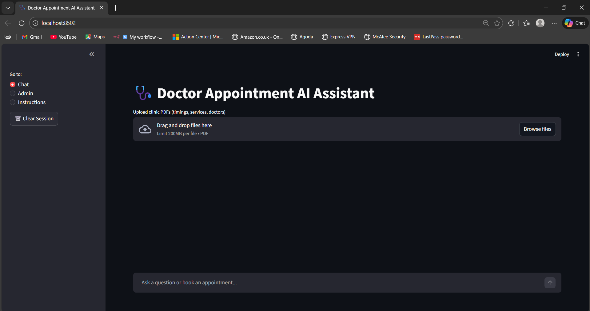
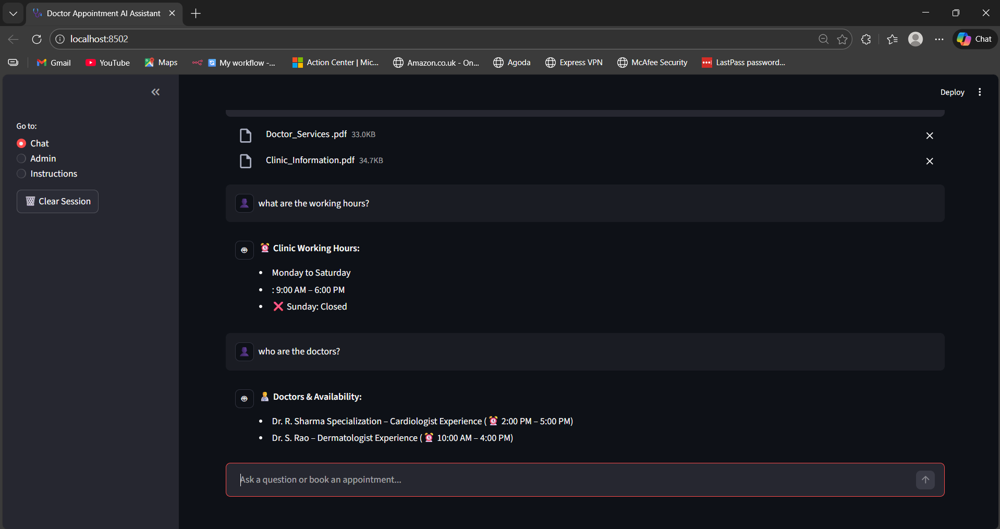
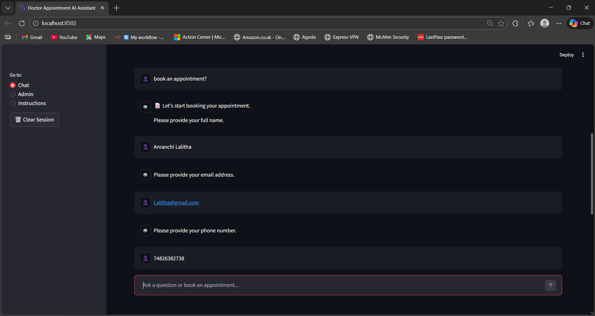
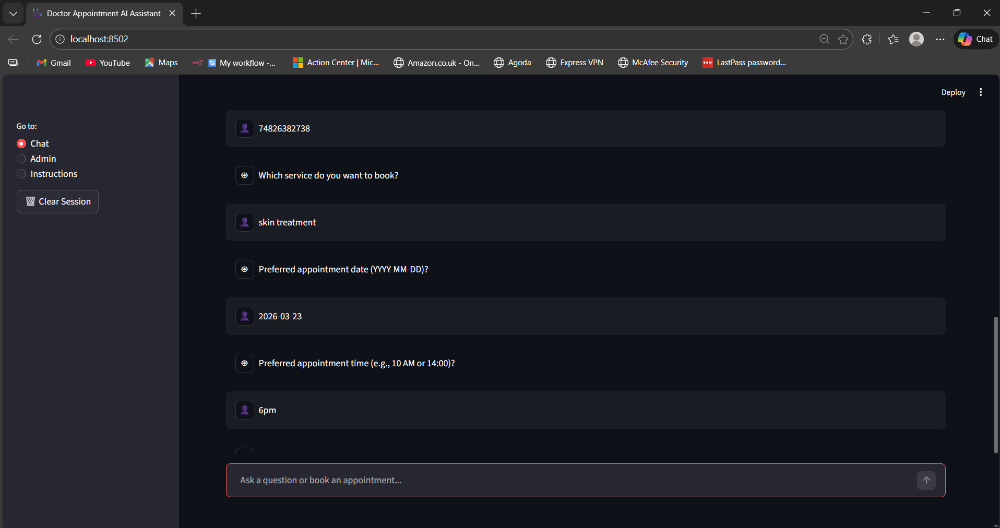
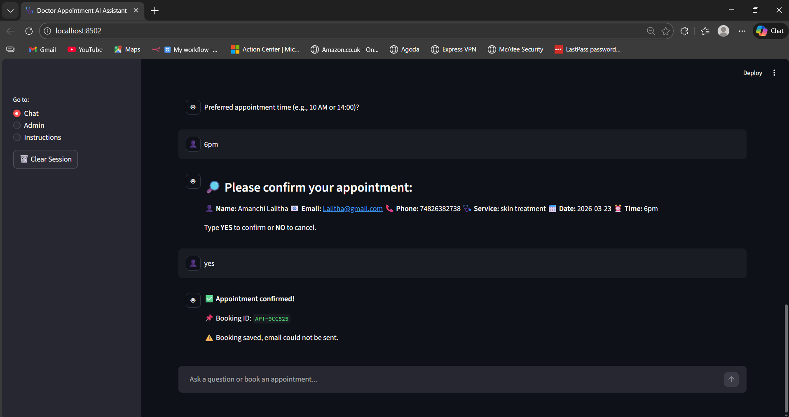
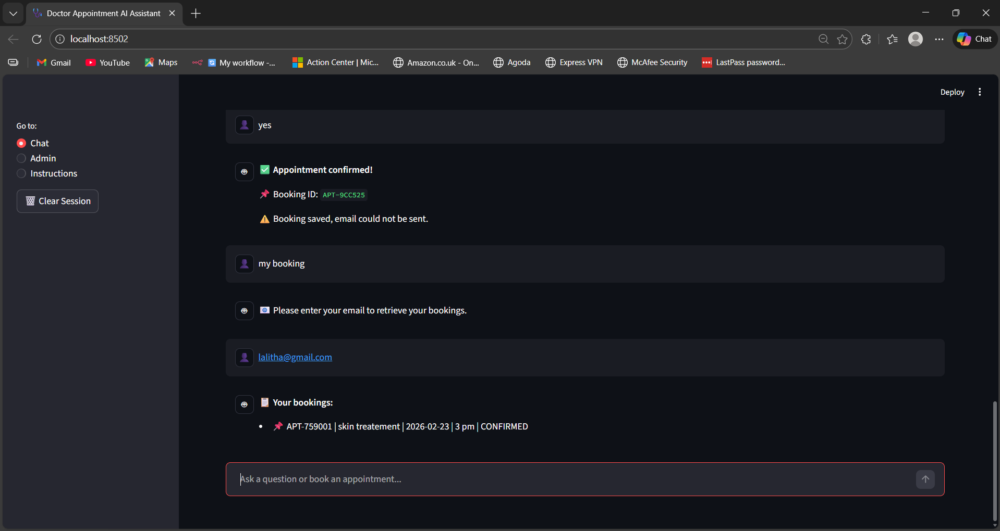
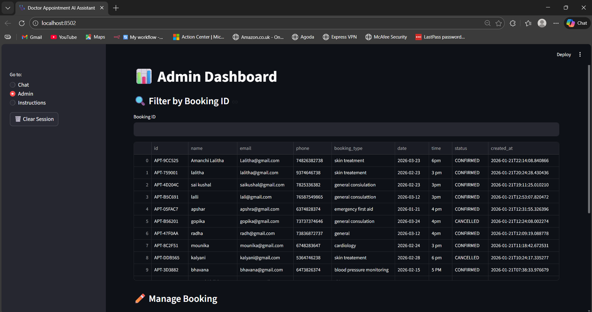

# 🩺 Doctor Appointment AI Assistant

## 📌 Project Overview
This project is an **AI-driven Booking Assistant** built using **Streamlit** that allows users to:
- Ask clinic-related questions using **RAG (Retrieval-Augmented Generation)** from uploaded PDFs
- Book doctor appointments through a conversational chat interface
- Receive **email confirmations** after booking
- Retrieve past bookings using email
- Allow admins to view, manage, and export bookings

The application is deployed as a **public Streamlit app** and fulfills all requirements of the AI Engineer Internship assignment.

---

## 🎯 Objective (As per Assignment)
Design and implement a chat-based AI assistant that:
- Uses RAG over user-uploaded PDFs
- Detects booking intent and collects required details
- Confirms booking details before saving
- Stores bookings in a database
- Sends email confirmations
- Provides an Admin Dashboard
- Is deployed on Streamlit Cloud

✅ **All objectives are satisfied in this project**

---

## 🧠 AI Components Used
- **Sentence Transformers** (`all-MiniLM-L6-v2`) for PDF embeddings
- **FAISS** for semantic similarity search
- **RAG Pipeline** for answering clinic-related queries
- **Intent Detection** (rule-based NLP)
- **Context Memory** (last 25 chat messages)

No paid APIs are used. The solution runs fully locally.

---

## 🗂️ Project Features

### 1. Chat-Based Interface
- Built using `st.chat_message` and `st.chat_input`
- Clear separation of user and bot messages
- Avatars and loading spinners for better UX




---

### 2. PDF-based RAG (Clinic Knowledge)
Users can upload clinic PDFs containing:
- Doctors and their availability
- Services offered
- Working hours
- Address and contact info

The assistant answers questions like:
- “What services do you have?”
- “Who are the doctors?”
- “Is Sunday a working day?”
- “What are the clinic timings?”




---

### 3. Booking Flow (Multi-turn)
The booking flow follows these steps:

1. Detect booking intent  
2. Ask only missing details  
3. Validate inputs (email, date, time, phone)  
4. Summarize all details  
5. Ask for confirmation  
6. On confirmation:
   - Save booking to SQLite DB
   - Send confirmation email
7. Respond with Booking ID
8. Store conversation history




---

### 4. Email Confirmation
After successful booking, the system sends an email using **SMTP (Gmail App Password)**.

Email includes:
- User name
- Booking ID
- Service
- Date & Time

If email fails:
> “Booking saved, but email could not be sent.”




---

### 5. Booking Retrieval (User)

Users can retrieve their bookings using chat commands.

#### Chat Commands:
```
my booking
```
or
```
my appointment
```

The assistant then asks for email:
```
📧 Please enter your email to retrieve your bookings.
```

After entering email:
```
📋 Your bookings:
- APT-XXXX | Service | Date | Time | Status
```




---

### 6. Admin Dashboard (Mandatory)
Admins can:
- View all bookings
- Filter by Booking ID
- Cancel bookings
- Update booking status
- Export bookings as CSV




---

## 💾 Data Storage
- **SQLite** database (`appointments.db`)
- Tables:
  - `customers(customer_id, name, email, phone)`
  - `bookings(id, customer_id, booking_type, date, time, status, created_at)`

Note: SQLite reset on redeploy is acceptable as per assignment.

---

## ⚠️ Error Handling
Handled cases include:
- Invalid email format
- Wrong date/time format
- Missing booking fields
- Email delivery failure
- Empty / invalid PDFs
- Database errors

Friendly messages are shown to the user.


## 🚀 Deployment

### Platform
- **Streamlit Cloud**

### Files Used
- `requirements.txt`
- `.streamlit/secrets.toml` (for email credentials)

### Run Locally
```bash
streamlit run app.py
```

---

## 🌐 Live Deployment (Streamlit Cloud)

The application has been successfully deployed on **Streamlit Cloud** and is publicly accessible.

🔗 **Live App URL**  
https://aiusecase-anwgr7zgzrbjwrxgzybbpm.streamlit.app/

### Deployment Details
- Platform: Streamlit Cloud
- Source Code: GitHub repository
- Environment Variables managed using `.streamlit/secrets.toml`
- SQLite used for persistence (acceptable to reset on redeploy as per assignment)

### Tested on Deployment
- PDF upload and RAG-based Q&A
- Booking flow with confirmation
- Email notification (SMTP)
- Booking retrieval
- Admin dashboard
- Input validation and error handling


## 🧪 Testing Checklist
- [x] PDF upload & RAG responses
- [x] Booking flow & confirmation
- [x] Email delivery
- [x] DB persistence
- [x] Booking retrieval
- [x] Admin dashboard
- [x] Input validation
- [x] Error handling

---

## 📌 Conclusion
This project demonstrates:
- End-to-end AI application development
- Practical use of RAG
- Conversational UX design
- Backend persistence
- Deployment readiness

It fully meets the **AI Engineer Internship assignment requirements** and is production-ready for demo purposes.

---

## 👩‍💻 Author
**A. Lalitha**  
